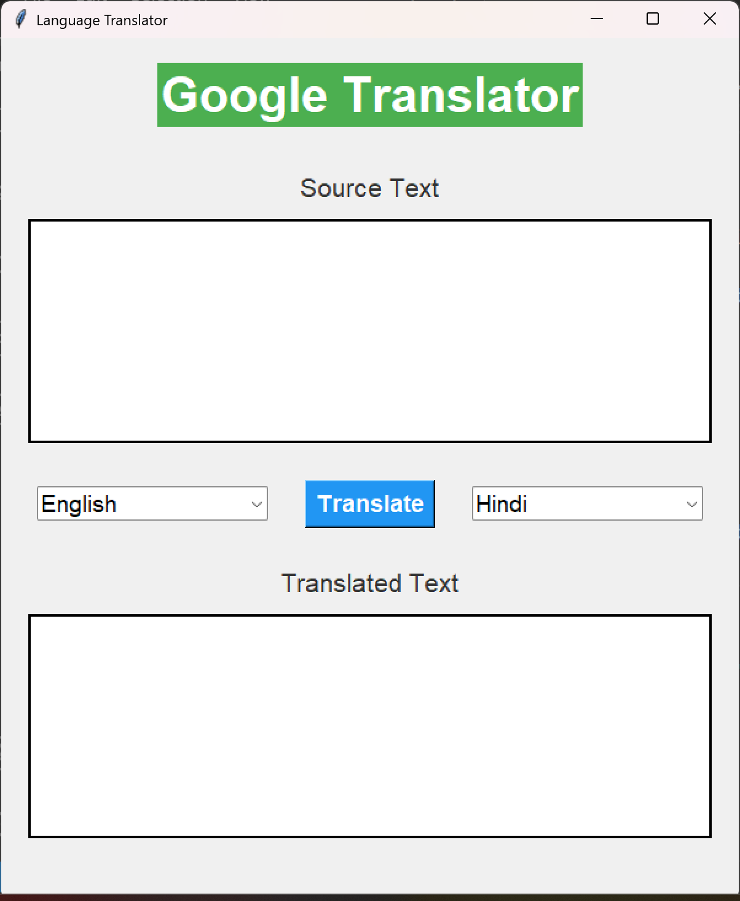

# 🌐 Language Translator (Python GUI)

A simple and interactive **Language Translator GUI app** using **Python**, **Tkinter**, and **Google Translate API** (`googletrans`). Easily translate text between various languages with just a few clicks.

---

## 📌 Features

* 🌍 Translate between **100+ languages**
* 📝 Input text and get real-time translated output
* 🔄 Select source and target languages using dropdowns
* 🖱️ Clean and responsive user interface using Tkinter
* 🧠 Powered by `googletrans` (Google Translate API wrapper)

---

## 📷 GUI Preview



---

## 📦 Requirements

Before running the app, install the required package:

```bash
pip install googletrans==4.0.0-rc1
```

> 📌 Note: `googletrans` uses a free, unofficial API and may sometimes be unstable. Make sure to use the correct version.

---

## 🧑‍💻 Author

Developed by **Akarsh Kumar** using Python and Tkinter 💻
